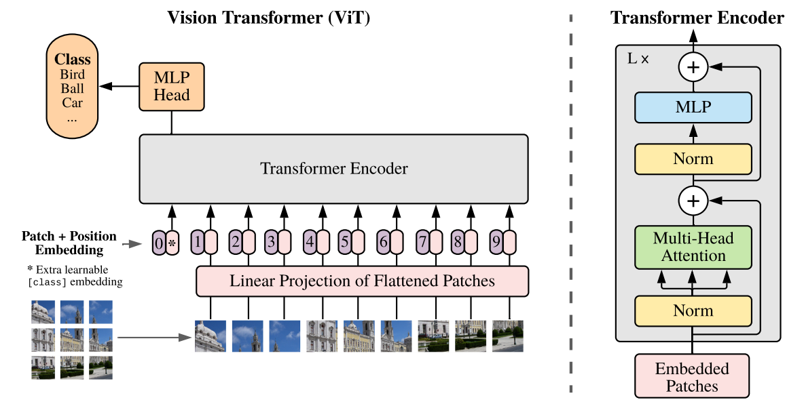

# FINAL PROJECT FOR MIMZ03
### ATTENTION:
For the class MIMZ03 final project.  **DO NOT** include all the code in my project. 

**Clone the Code Repository**

```python
git clone https://github.com/rokudoyly/mimz03.git
```

# Classification

Including ***two*** parts: 

## SVM part

##### Prerequisites:

**Running svm training:**

```python
python svm_class.py
```

**Update Settings in** `config.py`

<u>**(option)**</u> **Data augmentation and split data in** `data_augmentation.py` and  `split_data.py` 

## transformer

Include ViT-Base.

ViT network architecture:



# Crawling

Including ***two*** parts: 

## papers

**Prerequisites:**

**Running crawling paper:**

```python
python crawling.py
```

**Running crawling paper (pooling):**

```python
python crawling_pooling.py
```

## images

**Prerequisites:**

**Running crawling images:**

```python
python crawling_img.py
```

The default crawling number of images is 1 (each class).

## Citations

```
@article{dosovitskiy2020image,
  title={An image is worth 16x16 words: Transformers for image recognition at scale},
  author={Dosovitskiy, Alexey and Beyer, Lucas and Kolesnikov, Alexander and Weissenborn, Dirk and Zhai, Xiaohua and Unterthiner, Thomas and Dehghani, Mostafa and Minderer, Matthias and Heigold, Georg and Gelly, Sylvain and others},
  journal={arXiv preprint arXiv:2010.11929},
  year={2020}
}
```

## License

This project is open sourced under MIT license.

